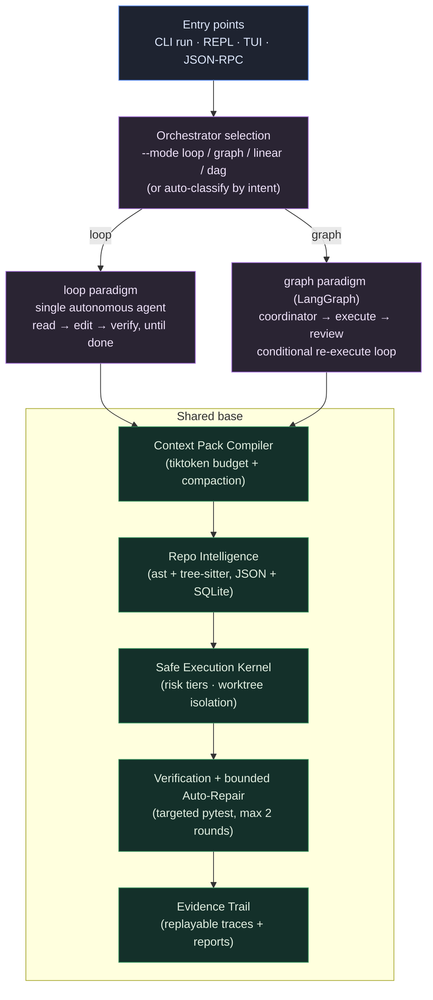

# xhx-agent

<div align="center">

[](https://github.com/kongshuilinhua/XHX-Agent)
[](https://www.python.org/)
[](LICENSE)
[](https://github.com/kongshuilinhua/XHX-Agent/actions/workflows/ci.yml)

**English** · [简体中文](README.zh-CN.md)

</div>

> A **context-budgeted local coding agent runtime** with a **pluggable, dual-paradigm orchestrator**: run a task as a single autonomous **`loop`** (Claude-Code-style) or as a multi-agent **`graph`** (LangGraph) — over one shared safety / context / code-intelligence base.

`xhx-agent` operates directly inside a local repository. It compiles a token-budgeted context pack before every model turn, classifies and gates shell commands through a safe execution kernel, edits inside an isolated git worktree, runs targeted tests, and records a replayable evidence trail. The same task can be driven by two interchangeable control-flow paradigms, selectable at runtime.

---

## Why this project is interesting

- **Pluggable dual-paradigm orchestrator.** One `Orchestrator` abstraction, two real implementations: an autonomous **`loop`** (read → edit → verify, iterating until done) and a **`graph`** built on a LangGraph `StateGraph` (coordinator → execute → review). They share the exact same tool, safety, context, and code-intelligence layers — only the top-level control flow differs. This makes the loop-vs-graph design trade-off concrete and directly comparable.
- **Token-budgeted Context Pack.** Each model turn is fed a deterministically-budgeted context pack (project map / task / source / evidence / errors), measured with `tiktoken` (`cl100k_base`) and pruned by priority when it overflows. Long autonomous histories are compacted rather than dropped.
- **Safe Execution Kernel.** Shell commands are tokenized (`shlex`) and classified into `safe` / `confirm` / `deny` tiers, with a denylisted-executable set, shell-metacharacter blocking, and inline-interpreter detection as defense-in-depth. Edits run in an isolated git worktree and are synced back only on success.
- **Repo intelligence.** A symbol / import / reference / call index built from Python's `ast` and tree-sitter (for JS/TS), persisted as JSON with a SQLite mirror, refreshed incrementally on file changes.
- **Honest implementation status.** The [implementation status](#implementation-status) section below states plainly what is fully implemented vs. simplified — no roadmap features are described as if shipped.

---

## Architecture



---

## Quick Start

`xhx-agent` ships with a built-in **`mock`** profile, so the full pipeline runs **offline with no API key** — ideal for trying it out, CI, and reproducible demos.

```bash
git clone https://github.com/kongshuilinhua/XHX-Agent.git
cd XHX-Agent
uv sync
```

Initialize the workspace and build the repo intelligence index in your target codebase:

```bash
uv run xhx init          # creates .xhx/, XHX.md, and the repo index
uv run xhx repo-index    # prints index diagnostics
```

Real output from this repository:

```text
repo index: current
schema: 1
files: 165
symbols: 860
import edges: 388
call edges: 2000
references: 2000
```

Run a task headlessly. `--dry-run` previews the plan and token budget without editing files:

```bash
uv run xhx run "explain the orchestrator architecture" --profile mock --dry-run
```

```text
status: success
summary: Read-only mock plan.
steps: 1
context: 5068/6000 estimated tokens
trace: .xhx/traces/dry-run-...jsonl
```

Pick the orchestrator paradigm explicitly with `--mode`:

```bash
uv run xhx run "refactor the math helpers" --profile mock --mode loop    # autonomous loop
uv run xhx run "refactor the math helpers" --profile mock --mode graph   # LangGraph workflow
```

Open the interactive REPL or the full-screen dashboard:

```bash
uv run xhx chat              # prompt-toolkit REPL with slash commands
uv run xhx tui --fullscreen  # Textual dashboard
```

---

## Two execution paradigms

Both run over the identical tool / safety / context / code-intelligence base — only the control flow differs.

| | `loop` (default) | `graph` |
|:--|:--|:--|
| **Style** | Single autonomous agent, Claude-Code-style | Multi-agent workflow, LangGraph `StateGraph` |
| **Control flow** | One model keeps iterating read → edit → verify across up to `max_loop_turns` (default 20) until it reports done | Explicit nodes: coordinator → execute → review, with a conditional re-execute loop (max 2 review rounds) |
| **Concurrency** | Read-only steps within a turn run concurrently (subagent-style) | Node-level orchestration via the graph |
| **Best for** | Open-ended edit tasks, exploratory work | Tasks where an explicit plan/review separation is desirable |
| **Select via** | `--mode loop` / `/mode loop` | `--mode graph` / `/mode graph` |

The auto-classification fallback (when `--mode` is omitted) routes by intent into `direct` / `research-only` / `linear-edit` / `dag-execute`.

---

## Commands

### CLI

```bash
uv run xhx run "<task>" [options]
```

| Option | Description |
|:--|:--|
| `--profile <name>` | LLM profile from `.xhx/profiles.json` (`mock` runs offline). |
| `--mode <loop\|graph\|linear\|dag>` | Pick the orchestrator paradigm (default: auto-classify by intent). |
| `--auto-repair` | Enable up to 2 self-repair rounds when targeted verification fails. |
| `--dry-run` | Preview plan, token budget, and risks, then exit. |
| `-y`, `--yes` | Pre-approve `confirm`-tier commands (non-interactive). |
| `--json` | Emit the run result as structured JSON. |
| `--continue` | Resume from the most recent session, injecting its summary as context. |
| `--resume <run-id>` | Resume from a specific past session (`xhx sessions` lists them). |

Other commands: `init`, `repo-index`, `sessions`, `chat`, `tui`, `rpc` (JSON-RPC 2.0 over stdio), `replay <run-id>`, `benchmark`.

### REPL slash commands

`/help` · `/model` · `/mode` · `/status` · `/plan` · `/evidence` · `/context` · `/verify` · `/repair` · `/diff` · `/skills` · `/clear` · `/exit`

---

## Implementation status

Stated plainly so capability is never confused with roadmap.

**Fully implemented**
- Pluggable dual-paradigm orchestrator: `loop` (autonomous) and `graph` (LangGraph), wired into all three entry points (CLI `--mode`, REPL/TUI `/mode`).
- Context Pack compiler with `tiktoken` budgeting, priority pruning, and history compaction (heuristic, or LLM summary in autonomous mode with heuristic fallback).
- Safe Execution Kernel: risk tiering, denylist + metacharacter + inline-interpreter blocking, git-worktree isolation, in-place Restore Plan fallback.
- Repo intelligence: symbol / import / reference / call index — Python via `ast`, JS/TS symbols via tree-sitter — persisted as JSON with a SQLite mirror and incremental refresh on file change.
- Verification router + bounded (≤2-round) auto-repair; replayable evidence traces; session recovery (`--continue` / `--resume` / `sessions`).
- REPL (prompt-toolkit) and full-screen TUI (Textual); JSON-RPC 2.0 stdio interface; offline `mock` profile; benchmark + replay.

**Simplified / partial (by design)**
- The `dag-execute` node generator is a heuristic baseline; LLM-driven decomposition of arbitrary requests is not implemented. Open-ended edits are best run in `loop`.
- The reference index is text-level symbol-name matching, not semantic resolution.
- JS/TS import and call extraction uses regex (only JS/TS *symbols* use tree-sitter); Python uses full `ast`.
- The `graph` paradigm is a deliberately lean 3-node workflow, kept minimal for a clean contrast against `loop`.

See [`docs/implementation/20-implementation-baseline.md`](docs/implementation/20-implementation-baseline.md) and [`docs/01-architecture.md`](docs/01-architecture.md) for details.

---

## Project layout

```text
src/xhx_agent/
  orchestrators/   loop · graph · linear · dag, behind one Orchestrator protocol
  context/         Context Pack compiler + token budgeting + compaction
  repo_intel/      symbol / import / reference / call index (ast + tree-sitter, JSON + SQLite)
  safety/          risk classification · policy · worktree · checkpoints · repair
  planner/         intent classifier · execution modes · reviewer · agents
  verification/    targeted test router
  evidence/        trace store + report generation
  runtime/         app loop · sessions · config · DAG runner
  models/          mock + OpenAI-compatible profiles
  cli/ · tui/      REPL, full-screen dashboard, JSON-RPC
```

---

## Development

```bash
uv run pytest          # test suite
uv run ruff check .    # lint
uv run ruff format .   # format
uv run mypy src        # type-check
```

---

<div align="center">
Built by <a href="https://github.com/kongshuilinhua/XHX-Agent">kongshuilinhua</a> · MIT License
</div>
