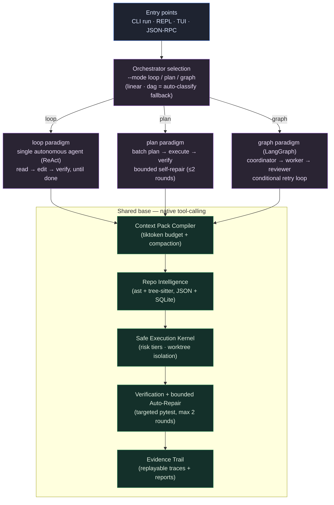

# xhx-agent

<div align="center">

[](https://github.com/kongshuilinhua/XHX-Agent)
[](https://www.python.org/)
[](LICENSE)
[](https://github.com/kongshuilinhua/XHX-Agent/actions/workflows/ci.yml)
[](https://github.com/kongshuilinhua/XHX-Agent/actions/workflows/ci.yml)

**English** · [简体中文](README.zh-CN.md)

</div>

> A **context-budgeted local coding agent runtime** with a **pluggable, tri-paradigm orchestrator**: run the same task as a single autonomous **`loop`** (ReAct, Claude-Code-style), as a batch-planned **`plan`** (Plan-Execute), or as a multi-agent **`graph`** (LangGraph) — all three speaking the **same native tool-calling protocol** over one shared safety / context / code-intelligence base.

`xhx-agent` operates directly inside a local repository. It compiles a token-budgeted context pack before every model turn, classifies and gates shell commands through a safe execution kernel, edits inside an isolated git worktree, runs targeted tests, and records a replayable evidence trail. The same task can be driven by three interchangeable control-flow paradigms, selectable at runtime — so the loop-vs-plan-vs-graph design trade-off is concrete, comparable, and **benchmarked with real numbers**.

---

## Why this project is interesting

- **One protocol, three paradigms.** A single `Orchestrator` abstraction with three real implementations that all drive the model through **native tool-calling** (no bespoke "model plan" DSL): an autonomous **`loop`** (read → edit → verify, iterating until done), a **`plan`** (batch-plan → execute → verify with bounded self-repair), and a **`graph`** built on a LangGraph `StateGraph` (coordinator → worker → reviewer, with a conditional retry loop). They share the exact same tool, safety, context, and code-intelligence layers — only the top-level control flow differs. All three are **verified end-to-end against a real model** (DeepSeek), not just the offline mock.
- **Quantified, not hand-waved.** A built-in [benchmark harness](#benchmark-quantifying-the-paradigms) runs a fixture task-set across all three paradigms and emits a comparison report (turns / tokens / wall-clock / success / files changed) as Markdown + JSON. The token meter makes the multi-agent overhead a number: `graph` spends **~3× the tokens** of single-agent `loop`/`plan` for the same work.
- **Token-budgeted Context Pack.** Each model turn is fed a deterministically-budgeted context pack (project map / task / source / evidence / errors), measured with `tiktoken` (`cl100k_base`) and pruned by priority when it overflows. Long autonomous histories are compacted rather than dropped.
- **Safe Execution Kernel.** Shell commands are tokenized (`shlex`) and classified into `safe` / `confirm` / `deny` tiers, with a denylisted-executable set, shell-metacharacter blocking, and inline-interpreter detection as defense-in-depth. Edits run in an isolated git worktree and are synced back only on success.
- **Repo intelligence.** A symbol / import / reference / call index built from Python's `ast` and tree-sitter (for JS/TS), persisted as JSON with a SQLite mirror, refreshed incrementally on file changes.
- **Honest implementation status.** The [implementation status](#implementation-status) section states plainly what is fully implemented vs. simplified — and the [engineering notes](#engineering-notes-what-building-this-taught-me) record what broke against a real model and what a prompt alone could *not* fix.

---

## Architecture



All three paradigms issue the same tool calls (`search`, `read_file`, `apply_patch`, `verify`, `dispatch`, …) through the same kernel — the difference is purely *who decides what to call next*: one agent (`loop`), a plan-then-execute controller (`plan`), or a coordinator/worker/reviewer team (`graph`).

---

## Quick Start

`xhx-agent` ships with a built-in **`mock`** profile, so the full pipeline runs **offline with no API key** — ideal for trying it out, CI, and reproducible demos.

```bash
git clone https://github.com/kongshuilinhua/XHX-Agent.git
cd XHX-Agent
uv sync
```

Initialize the workspace and build the repo intelligence index in your target codebase:

```bash
uv run xhx init          # creates .xhx/, XHX.md, and the repo index
uv run xhx repo-index    # prints index diagnostics
```

Real output from this repository:

```text
repo index: current
schema: 1
files: 165
symbols: 860
import edges: 388
call edges: 2000
references: 2000
```

Run a task headlessly. `--dry-run` previews the plan and token budget without editing files:

```bash
uv run xhx run "explain the orchestrator architecture" --profile mock --dry-run
```

```text
status: success
summary: Read-only mock plan.
steps: 1
context: 5068/6000 estimated tokens
trace: .xhx/traces/dry-run-...jsonl
```

Pick the orchestrator paradigm explicitly with `--mode`:

```bash
uv run xhx run "refactor the math helpers" --profile mock --mode loop    # autonomous ReAct loop
uv run xhx run "refactor the math helpers" --profile mock --mode plan    # plan → execute → verify
uv run xhx run "refactor the math helpers" --profile mock --mode graph   # LangGraph multi-agent
```

Open the interactive REPL or the full-screen dashboard:

```bash
uv run xhx chat              # prompt-toolkit REPL with slash commands
uv run xhx tui --fullscreen  # Textual dashboard
```

---

## Three execution paradigms

All three run over the identical tool / safety / context / code-intelligence base and the same native tool-calling protocol — only the control flow differs.

| | `loop` (default) | `plan` | `graph` |
|:--|:--|:--|:--|
| **Style** | Single autonomous agent (ReAct) | Plan-Execute controller | Multi-agent workflow (LangGraph `StateGraph`) |
| **Control flow** | One model iterates read → edit → verify across up to `max_loop_turns` until it reports done | Plans the whole task up front, executes the steps, verifies, and runs bounded self-repair on failure | Explicit roles: coordinator splits the task → a write-capable worker executes each sub-task → reviewer judges PASS/FAIL, with a conditional re-execute loop |
| **Decomposition** | Implicit, per-turn | Batch, up front | Coordinator-driven, into sub-tasks |
| **Best for** | Open-ended edits, exploratory work | Tasks that benefit from an explicit plan + verification gate | Tasks where plan / execute / review separation across roles is valuable |
| **Real-model overhead** | Lowest (1 agent) | Low (1 agent + verify) | Highest (~3× tokens — multi-agent chatter) |
| **Select via** | `--mode loop` / `/mode loop` | `--mode plan` / `/mode plan` | `--mode graph` / `/mode graph` |

When `--mode` is omitted, an intent classifier routes the task through a lightweight `linear` / `dag` fallback (`direct` / `research-only` / `linear-edit` / `dag-execute`). These two are **supporting mechanisms for the auto-classify path**, not headline paradigms — for any non-trivial task, pick `loop`, `plan`, or `graph` explicitly.

---

## Benchmark: quantifying the paradigms

The core thesis — *one base, three interchangeable paradigms* — is only convincing with numbers. `xhx benchmark` runs a fixture task-set across the paradigms and writes a comparison report (`.xhx/benchmark/report.md` + `report.json`):

```bash
uv run xhx benchmark --modes loop,plan,graph                 # offline, deterministic (mock)
uv run xhx benchmark --modes loop,plan,graph --profile default  # real model (DeepSeek)
```

**Offline `mock` run** (deterministic, reproducible, CI-friendly — three read-only research fixtures):

| Paradigm | Tasks | Mean turns | Mean tokens | Mean wall-clock (s) |
|:--|:--:|:--:|:--:|:--:|
| `loop` | 3 | 1.0 | ~978 | 0.40 |
| `plan` | 3 | 1.0 | ~986 | 0.38 |
| `graph` | 3 | 2.0 | ~2919 | 0.77 |

The headline is the **token column**: the multi-agent `graph` spends roughly **3× the tokens** of the single-agent `loop`/`plan` to cover the same ground — coordinator + worker + reviewer each carry their own context. That is the price of explicit role separation, now measured instead of asserted.

> The `mock` profile is deterministic but does not exercise the LLM coordination/review that `graph` depends on, so `graph`'s success rate is only meaningful under a real model. Against DeepSeek, `graph` completes the same fixtures and passes review (typically in a single round); `loop` and `plan` converge in a handful of turns. Reproduce the real-model table yourself with the `--profile default` command above (requires a `DEEPSEEK_API_KEY` in your environment).

---

## Engineering notes: what building this taught me

Three findings worth more than a green test suite — each is a place where a *real* model diverged from the comfortable offline mock.

**1 · `apply_patch` met the real model.** The patch tool was first built around a custom `*** Begin Patch … *** End Patch` envelope, and the offline mock dutifully produced it. Switched to real DeepSeek, *every* edit failed: `Patch must start with *** Begin Patch`. The real model emits **unified diffs** — often wrapped in a ```` ```diff ```` fence — not the bespoke envelope. The fix was to make the parser dispatch by *format*: envelope, unified diff (`---` / `+++` / `@@`, with `/dev/null` meaning a new file), and a fence-stripping pre-pass. **Lesson:** mock parity is not real parity. The real model's output distribution *is* the spec you have to parse.

**2 · A prompt is not a silver bullet.** I added a `dispatch` tool so the agent could hand a focused, multi-file investigation to an isolated read-only sub-agent — keeping the parent's context clean. The capability is wired, gated, and correct. But even with explicit prompt guidance, the real model overwhelmingly prefers to just read the files itself and rarely reaches for `dispatch`. Rather than dress that up, I'm recording it plainly: **changing model behavior often needs a stronger mechanism than a paragraph in the system prompt** — and knowing the difference is part of the job.

**3 · Putting a number on coordination.** A small token meter wraps every model call, accumulating a `tiktoken` estimate of the outgoing context into the run metrics. That is what turns "graph has more overhead" into "graph costs ~3× the tokens" in the table above. Cheap to build, and it converts an architectural intuition into something a reviewer can check.

---

## Commands

### CLI

```bash
uv run xhx run "<task>" [options]
```

| Option | Description |
|:--|:--|
| `--profile <name>` | LLM profile from `.xhx/profiles.json` (`mock` runs offline). |
| `--mode <loop\|plan\|graph\|linear\|dag>` | Pick the orchestrator paradigm (default: auto-classify by intent). |
| `--auto-repair` | Enable up to 2 self-repair rounds when targeted verification fails. |
| `--dry-run` | Preview plan, token budget, and risks, then exit. |
| `-y`, `--yes` | Pre-approve `confirm`-tier commands (non-interactive). |
| `--json` | Emit the run result as structured JSON. |
| `--continue` | Resume from the most recent session, injecting its summary as context. |
| `--resume <run-id>` | Resume from a specific past session (`xhx sessions` lists them). |

Other commands: `init`, `repo-index`, `sessions`, `chat`, `tui`, `rpc` (JSON-RPC 2.0 over stdio), `replay <run-id>`, `benchmark`.

### REPL slash commands

`/help` · `/model` · `/mode` · `/status` · `/plan` · `/evidence` · `/context` · `/verify` · `/repair` · `/diff` · `/skills` · `/clear` · `/exit`

---

## Implementation status

Stated plainly so capability is never confused with roadmap.

**Fully implemented**
- Tri-paradigm orchestrator on one native tool-calling protocol: `loop` (autonomous ReAct), `plan` (Plan-Execute with bounded self-repair), and `graph` (LangGraph coordinator → worker → reviewer) — all wired into every entry point (CLI `--mode`, REPL/TUI `/mode`) and all verified end-to-end against a real model.
- Isolated read-only sub-agents via the `dispatch` tool (focused exploration with its own message history and a restricted toolset).
- Three-paradigm benchmark harness (`xhx benchmark --modes …`) emitting a Markdown + JSON comparison report, with per-call token metering.
- Context Pack compiler with `tiktoken` budgeting, priority pruning, and history compaction (heuristic, or LLM summary in autonomous mode with heuristic fallback).
- Safe Execution Kernel: risk tiering, denylist + metacharacter + inline-interpreter blocking, git-worktree isolation, in-place Restore Plan fallback.
- Repo intelligence: symbol / import / reference / call index — Python via `ast`, JS/TS symbols via tree-sitter — persisted as JSON with a SQLite mirror and incremental refresh on file change.
- Verification router + bounded (≤2-round) auto-repair; replayable evidence traces; session recovery (`--continue` / `--resume` / `sessions`).
- REPL (prompt-toolkit) and full-screen TUI (Textual); JSON-RPC 2.0 stdio interface; offline `mock` profile; benchmark + replay.

**Simplified / partial (by design)**
- `linear` / `dag` are retained as the lightweight auto-classify fallback (used only when `--mode` is omitted); the headline decomposition work happens in `plan` and `graph`, which are LLM-driven via tool-calling.
- The `graph` paradigm is a deliberately lean coordinator → worker → reviewer workflow, kept minimal for a clean contrast against `loop`/`plan`.
- `dispatch` covers a read-only `explore` sub-agent; write-capable and parallel sub-agents are future work.
- The reference index is text-level symbol-name matching, not semantic resolution.
- JS/TS import and call extraction uses regex (only JS/TS *symbols* use tree-sitter); Python uses full `ast`.

See [`docs/implementation/20-implementation-baseline.md`](docs/implementation/20-implementation-baseline.md) and [`docs/01-architecture.md`](docs/01-architecture.md) for details.

---

## Project layout

```text
src/xhx_agent/
  orchestrators/   loop · plan · graph (primary) + linear · dag (fallback), behind one Orchestrator protocol
  context/         Context Pack compiler + token budgeting + compaction
  repo_intel/      symbol / import / reference / call index (ast + tree-sitter, JSON + SQLite)
  safety/          risk classification · policy · worktree · checkpoints · repair
  planner/         intent classifier · execution modes · reviewer · agents
  verification/    targeted test router
  evals/           benchmark harness + RunMetrics
  evidence/        trace store + report generation
  runtime/         app loop · sessions · config
  models/          mock + OpenAI-compatible profiles
  cli/ · tui/      REPL, full-screen dashboard, JSON-RPC
```

---

## Development

```bash
uv run pytest          # test suite
uv run ruff check .    # lint
uv run ruff format .   # format
uv run mypy src        # type-check
```

---

<div align="center">
Built by <a href="https://github.com/kongshuilinhua/XHX-Agent">kongshuilinhua</a> · MIT License
</div>
