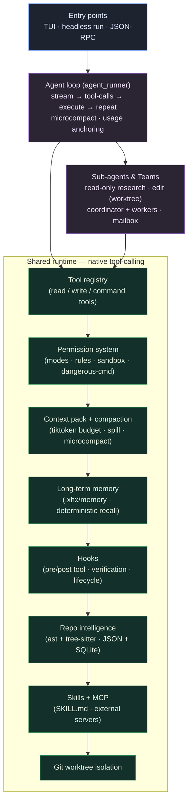

# xhx-agent

<div align="center">

[](https://github.com/kongshuilinhua/XHX-Agent)
[](https://www.python.org/)
[](LICENSE)
[](https://github.com/kongshuilinhua/XHX-Agent/actions/workflows/ci.yml)
[](https://github.com/kongshuilinhua/XHX-Agent/actions/workflows/ci.yml)

**English** · [简体中文](README.zh-CN.md)

</div>

> A **local coding agent** that works directly inside your repository — a single native **tool-calling** loop on top of a layered runtime: permission gating, MCP, token-budgeted context, long-term memory, skills, hooks, read-only/edit sub-agents, isolated git worktrees, and multi-agent teams. Verified end-to-end against a **real model** (DeepSeek), not just an offline mock.

`xhx-agent` runs an autonomous read → edit → verify loop. Every model turn streams token-by-token, every shell command and file write is gated through a permission system, long histories are kept inside a `tiktoken` budget via compaction, and durable facts persist across sessions in `.xhx/memory/`. It ships an interactive **Textual TUI**, a headless `xhx run`, and a JSON-RPC interface — all driven by the same agent core.

---

## Highlights

- **One native tool-calling loop.** A single agent (`agents/agent_runner.py`) iterates `read → search → edit → verify` over tools (`ReadFile`, `EditFile`, `WriteFile`, `ApplyPatch`, `Grep`, `Glob`, `Bash`, `RepoQuery`, `WebFetch`, `WebSearch`, `ToolSearch`, `Agent`, …) until it reports done — streaming output token-by-token and reassembling fragmented `tool_calls` over SSE.
- **A real permission system.** Tools are classified `read` / `write` / `command` and gated by mode (`default` / `acceptEdits` / `plan` / `bypassPermissions` / `dontAsk`) plus a three-tier rule engine (user → project → local, last-match-wins), dangerous-command detection, and a path sandbox. **Plan mode is two-stage**: the agent researches read-only, presents a plan, and only executes after you approve.
- **Context that stays in budget.** Each turn compiles a `tiktoken`-budgeted context pack; large tool results are spilled to disk with previews; long histories are compacted (**microcompact**) into a summary *without ever orphaning a tool result from its call*; cross-session resume rebuilds state from a `compact_boundary` record.
- **Cross-session long-term memory.** `.xhx/memory/` keeps durable facts (`user` / `feedback` / `project` / `reference`) with **deterministic recall** (keyword/token overlap, no extra LLM call) injected into the system prompt under budget. Verified end-to-end: a fact that exists *only* in memory is recalled and shapes the real model's answer.
- **Sub-agents & multi-agent teams.** Spawn a read-only **research** sub-agent or a write-capable **edit** sub-agent (its own worktree, merged back with conflict detection) via the `Agent` tool. Or stand up an **Agent Team** (coordinator + workers, mailbox messaging, shared task board) for parallel collaboration.
- **MCP, web, and skills.** Connect external **MCP** servers (stdio / Streamable HTTP / SSE) from `.xhx/mcp.json`; fetch and search the web (SSRF-guarded `WebFetch` + Tavily `WebSearch`); load **skills** (`SKILL.md`, three-tier builtin/user/project) that inject SOPs and slash commands on trigger.
- **Multi-model routing + graceful fallback.** Route roles to different model profiles and fall back down a profile chain on error/rate-limit; orthogonal to streaming.

---

## Architecture



The agent drives the model through native tool-calling; the permission system gates every call; the context layer keeps the prompt in budget; memory, hooks, repo-intelligence, skills/MCP, and worktree isolation hang off the same shared base. Sub-agents and teams reuse the identical tool/safety stack with a filtered toolset.

---

## Quick Start

`xhx-agent` ships a built-in **`mock`** profile, so the full pipeline runs **offline with no API key** — handy for trying it out, CI, and reproducible demos.

```bash
git clone https://github.com/kongshuilinhua/XHX-Agent.git
cd XHX-Agent
uv sync
```

Initialize a workspace and build the repo-intelligence index inside your target codebase:

```bash
uv run xhx init          # creates .xhx/, XHX.md, and the repo index
uv run xhx repo-index    # prints index diagnostics
```

**Configure your model once, use it from any directory.** Model config resolves
`project .xhx/ → user-level ~/.xhx/ → built-in placeholder`:

```bash
uv run xhx init --global   # writes ~/.xhx/{config.json,profiles.json}
# edit the `default` profile in ~/.xhx/profiles.json (base_url / model / api_key_env),
# export that API key — now xhx works from anywhere. A project .xhx/profiles.json
# still overrides the global one (e.g. pin `mock` for CI).
```

Open the interactive agent (the primary interface):

```bash
uv run xhx tui     # full-screen Textual TUI
uv run xhx chat    # same TUI (alias)
```

In the TUI the model's reply **streams token-by-token**; tool calls render inline with results; the status bar shows mode · context usage · tool count · model. Type `/` for the command menu. **Plan mode** is two-stage — `/plan` switches to read-only research, the agent presents a plan, and you approve before any edit runs. `shift+tab` cycles permission modes.

Run a task headlessly (for scripts / CI):

```bash
uv run xhx run "explain the agent architecture" --profile mock
uv run xhx run "fix the failing test in src/calc.py"      # real model via your default profile
uv run xhx run "keep going" --continue                    # resume the most recent session
```

---

## Features

The runtime is organized into focused, independently-testable layers:

| Layer | What it does |
|:--|:--|
| **Tool system** | One `ToolRegistry` of `Tool` instances (read/write/command categories); deferred tools discovered via `ToolSearch`; parallel execution for concurrency-safe tools. |
| **Agent loop** | Streaming native tool-calling loop with usage anchoring, max-iteration guard, and unknown-tool termination. |
| **System prompt** | Composed from instructions (`XHX.md`), environment context, skill catalog, agent catalog, and injected memory. |
| **Permissions** | Modes + three-tier rule engine + path sandbox + dangerous-command detection; two-stage plan mode; inline approval dialogs in the TUI. |
| **MCP** | Connect external MCP servers (stdio / HTTP / SSE) from `.xhx/mcp.json`; tools register as `mcp_<server>_<tool>` under the same gate; failed servers are skipped. |
| **Context management** | `tiktoken` budgeting, large-result spill-to-disk with previews, and validity-preserving microcompact of long histories. |
| **Memory** | Long-term facts with deterministic recall + freshness check; per-session JSONL persistence and resume. |
| **Slash commands** | A command registry driving the TUI (see [Commands](#commands)). |
| **Skills** | `SKILL.md` (three-tier) with trigger matching → SOP injection / slash commands. |
| **Hooks** | Event-driven engine (`pre/post_tool_use`, `pre_send`, `turn_*`, `session_*`) with `command` / `prompt` / `http` / `verification` actions. |
| **Sub-agents** | `Agent` tool spawns read-only research or write-capable edit sub-agents with a filtered toolset; edit agents work in isolated worktrees. |
| **Worktree** | Full git-worktree lifecycle (create / enter / exit / auto-cleanup) for isolated edits. |
| **Agent Teams** | Coordinator + workers, file-based mailbox messaging, shared task board, per-teammate progress. |

---

## Commands

### CLI

```bash
uv run xhx run "<task>" [options]
```

| Option | Description |
|:--|:--|
| `--profile <name>` | Model profile, resolved `project .xhx/ → ~/.xhx/ → built-in` (`mock` runs offline). |
| `--verify` | Run change-targeted tests after the agent stops. |
| `-y`, `--yes` | Pre-approve confirm-tier commands (non-interactive). |
| `--json` | Emit the run result as structured JSON. |
| `--continue` | Resume from the most recent session, injecting its summary as context. |
| `--resume <run-id>` | Resume from a specific past session (`xhx sessions` lists them). |

Other commands: `init` (`--global` for user-level `~/.xhx/`), `repo-index`, `sessions`, `tui` / `chat`, `rpc` (JSON-RPC 2.0 over stdio), `replay <run-id>`, `benchmark`, `memory`, `compact`, `config list` / `config set-profile`.

### TUI slash commands

`/help` · `/status` · `/model` · `/plan` · `/permission` · `/compact` · `/memory` · `/session` · `/skill` · `/mcp` · `/review` · `/rewind` · `/tools` · `/worktree` · `/tasks` · `/trace` · `/verbose` · `/cancel` · `/allow` · `/deny` · `/new` · `/clear` · `/exit`

Type `/` for the full menu; `/help <name>` shows usage for one command. `/session` opens an up/down-selectable history picker to resume a past conversation.

---

## Implementation status

Stated plainly so capability is never confused with roadmap.

**Fully implemented**
- Native tool-calling agent loop with streaming, parallel concurrency-safe tools, usage anchoring, and microcompact of long histories.
- Permission system: `default` / `acceptEdits` / `plan` / `bypassPermissions` / `dontAsk` modes, three-tier rule engine (user → project → local), path sandbox, dangerous-command detection, two-stage plan mode, inline TUI approval dialogs.
- Context pack with `tiktoken` budgeting, large-result spill-to-disk + preview, and validity-preserving compaction; cross-session resume via `compact_boundary`.
- Long-term memory: 4-type facts, deterministic recall under budget, freshness check, per-session JSONL persistence + resume — verified end-to-end against a real model.
- Tools: `ReadFile` / `WriteFile` / `EditFile` (read-before-edit gate) / `ApplyPatch` (envelope + unified diff) / `Grep` / `Glob` / `Bash` (with background dev-server detection) / `RepoQuery` / `WebFetch` (SSRF-guarded) / `WebSearch` (Tavily) / `ToolSearch` / `Agent`.
- MCP clients over stdio / Streamable HTTP / SSE, registered under the safe gate; web tools; skills (`SKILL.md`, three-tier) with trigger matching.
- Hooks: lifecycle engine with `command` / `prompt` / `http` / `verification` actions.
- Sub-agents (read-only research + write-capable edit-in-worktree) and Agent Teams (coordinator + workers, mailbox, shared tasks).
- Git worktree lifecycle; repo intelligence (symbol / import / reference / call index, `ast` + tree-sitter, JSON + SQLite); multi-model routing + fallback.
- Interfaces: Textual TUI, headless `xhx run`, JSON-RPC 2.0 stdio; offline `mock` profile.
- CI: ruff (check + format), mypy (clean), pytest with a **75%** coverage floor.

**Simplified / partial (by design)**
- The older `--mode loop/plan/graph`, `--auto-repair`, and `--dry-run` flags on `xhx run` are **accepted but no-ops** — superseded by the single unified agent loop. Multi-agent work is reached through the `Agent` tool / Teams in the interactive runtime, not via `--mode`.
- The `hooks` `agent` action type (hook-triggered sub-agent) is **disabled** at config-load time — it was never implemented; the other three action types are live.
- Edit sub-agents run sequentially, each in its own worktree, merged back with conflict detection; truly *concurrent* sub-agent execution is a future optimization.
- The reference index is text-level symbol-name matching, not semantic resolution; JS/TS import/call extraction uses regex (only JS/TS *symbols* use tree-sitter; Python uses full `ast`).

See [`docs/01-architecture.md`](docs/01-architecture.md) for details.

---

## Project layout

```text
src/xhx_agent/
  agents/          agent loop (agent_runner) · AgentDef parser + three-tier loader · sub-agent · task manager · trace
  tools/           Tool registry + built-in tools (read/edit/write/bash/grep/glob/apply_patch/repo_query/web/tool-search)
  commands/        slash command registry + handlers
  context/         context pack compiler + tiktoken budgeting + history compaction (microcompact)
  memory/          long-term facts (deterministic recall) + session persistence/resume
  repo_intel/      symbol / import / reference / call index (ast + tree-sitter, JSON + SQLite)
  safety/          risk classification · policy · permissions (rules/sandbox/modes) · worktree checkpoints
  hooks/           event-driven hook engine (command/prompt/http/verification actions)
  skills/          SkillLoader (SKILL.md, three-tier) + MCP client manager
  teams/           Agent Teams: coordinator + workers · mailbox · shared task store
  worktree/        git worktree lifecycle (create/enter/exit/cleanup)
  verification/    targeted test router (drives the verification hook)
  filehistory/     per-session file edit history (rewind support)
  evals/           benchmark harness + replay + RunMetrics
  evidence/        trace store + report generation
  models/          mock + OpenAI-compatible (streaming) + multi-model routing & fallback
  runtime/         headless driver · sessions · config (incl. routing) · context-window resolve
  cli/ · tui/      CLI, prompt-toolkit input, full-screen Textual TUI, JSON-RPC
```

---

## Development

```bash
uv run pytest          # test suite (489 passed, ~75% coverage)
uv run ruff check .    # lint
uv run ruff format .   # format
uv run mypy src        # type-check
```

---

<div align="center">
Built by <a href="https://github.com/kongshuilinhua/XHX-Agent">kongshuilinhua</a> · MIT License
</div>
