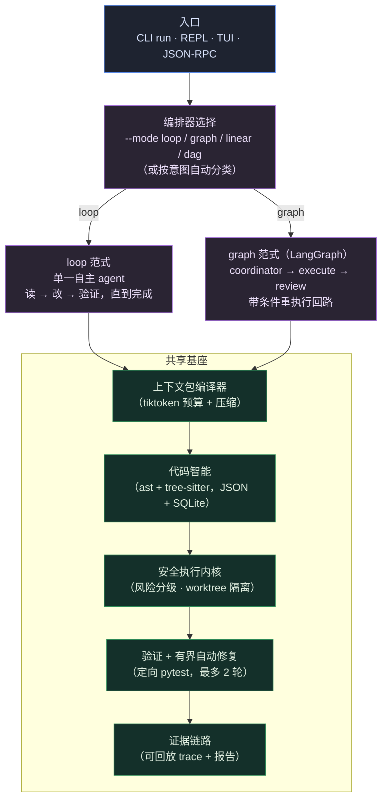

# xhx-agent

<div align="center">

[](https://github.com/kongshuilinhua/XHX-Agent)
[](https://www.python.org/)
[](LICENSE)
[](https://github.com/kongshuilinhua/XHX-Agent/actions/workflows/ci.yml)
[](https://github.com/kongshuilinhua/XHX-Agent/actions/workflows/ci.yml)

[English](README.md) · **简体中文**

</div>

> 一个**上下文预算化的本地编码 agent 运行时**，带**可插拔的双范式编排器**：同一个任务，既可以作为单一自主 **`loop`**（类 Claude Code 风格）驱动，也可以作为多 agent **`graph`**（基于 LangGraph）驱动——两者共用同一套安全 / 上下文 / 代码智能基座。

`xhx-agent` 直接运行在本地仓库内部。它在每一次模型调用前编译一份按 token 预算裁剪的上下文包（context pack），通过安全执行内核对 shell 命令进行分级与拦截，在隔离的 git worktree 中改代码，运行定向测试，并记录可回放的证据链路。同一个任务可以由两种可互换的控制流范式驱动，运行时即可选择。

---

## 这个项目有意思在哪

- **可插拔的双范式编排器。** 一套 `Orchestrator` 抽象，两个真实实现：自主 **`loop`**（读 → 改 → 验证，反复迭代直到完成）和基于 LangGraph `StateGraph` 的 **`graph`**（coordinator → execute → review）。两者共用完全相同的工具、安全、上下文、代码智能层——只有顶层控制流不同。这让 loop 与 graph 的设计取舍变得具体、可直接对比。
- **按 token 预算的上下文包。** 每一次模型调用都喂入一份确定性预算化的上下文包（项目地图 / 任务 / 源码 / 证据 / 错误），用 `tiktoken`（`cl100k_base`）精确计数，溢出时按优先级裁剪。长自主循环中的历史被压缩而非丢弃。
- **安全执行内核。** shell 命令经 `shlex` 分词后被分为 `safe` / `confirm` / `deny` 三档，配合可执行文件黑名单、shell 元字符拦截、内联解释器检测作为纵深防御。编辑在隔离的 git worktree 中进行，只有成功时才同步回原工作区。
- **代码智能。** 由 Python `ast` 与 tree-sitter（用于 JS/TS）构建的符号 / import / 引用 / 调用索引，以 JSON 主索引 + SQLite 镜像落盘，并在文件变更时增量刷新。
- **诚实的实现状态。** 下方的[实现状态](#实现状态)小节明确区分「已完整实现」与「简化 / 部分实现」——不把路线图功能写成已交付。

---

## 架构



---

## 快速开始

`xhx-agent` 内置一个 **`mock`** profile，因此整条流水线可以**离线、无需 API key** 运行——非常适合试用、CI 和可复现的演示。

```bash
git clone https://github.com/kongshuilinhua/XHX-Agent.git
cd XHX-Agent
uv sync
```

在你的目标代码库中初始化工作区并构建代码智能索引：

```bash
uv run xhx init          # 创建 .xhx/、XHX.md 和仓库索引
uv run xhx repo-index    # 打印索引诊断
```

来自本仓库的真实输出：

```text
repo index: current
schema: 1
files: 165
symbols: 860
import edges: 388
call edges: 2000
references: 2000
```

无头方式运行一个任务。`--dry-run` 预览计划与 token 预算，不改文件：

```bash
uv run xhx run "explain the orchestrator architecture" --profile mock --dry-run
```

```text
status: success
summary: Read-only mock plan.
steps: 1
context: 5068/6000 estimated tokens
trace: .xhx/traces/dry-run-...jsonl
```

用 `--mode` 显式指定编排器范式：

```bash
uv run xhx run "refactor the math helpers" --profile mock --mode loop    # 自主 loop
uv run xhx run "refactor the math helpers" --profile mock --mode graph   # LangGraph 工作流
```

打开交互式 REPL 或全屏看板：

```bash
uv run xhx chat              # 带 slash 命令的 prompt-toolkit REPL
uv run xhx tui --fullscreen  # Textual 看板
```

---

## 两种执行范式

两者跑在完全相同的工具 / 安全 / 上下文 / 代码智能基座之上——只有控制流不同。

| | `loop`（默认） | `graph` |
|:--|:--|:--|
| **风格** | 单一自主 agent，类 Claude Code | 多 agent 工作流，LangGraph `StateGraph` |
| **控制流** | 一个模型持续迭代 读 → 改 → 验证，最多 `max_loop_turns` 轮（默认 20），直到它报告完成 | 显式节点：coordinator → execute → review，带条件重执行回路（最多 2 轮 review） |
| **并发** | 一轮内的只读步骤并发执行（subagent 风格） | 通过图做节点级编排 |
| **适合** | 开放式编辑任务、探索性工作 | 需要明确「计划/复核」分离的任务 |
| **选择方式** | `--mode loop` / `/mode loop` | `--mode graph` / `/mode graph` |

省略 `--mode` 时的自动分类回退，会按意图路由到 `direct` / `research-only` / `linear-edit` / `dag-execute`。

---

## 命令

### CLI

```bash
uv run xhx run "<task>" [options]
```

| 选项 | 说明 |
|:--|:--|
| `--profile <name>` | 来自 `.xhx/profiles.json` 的 LLM profile（`mock` 离线运行）。 |
| `--mode <loop\|graph\|linear\|dag>` | 选择编排器范式（默认：按意图自动分类）。 |
| `--auto-repair` | 定向验证失败时，启用最多 2 轮自我修复。 |
| `--dry-run` | 预览计划、token 预算与风险后退出。 |
| `-y`, `--yes` | 预先批准 `confirm` 档命令（非交互）。 |
| `--json` | 以结构化 JSON 输出运行结果。 |
| `--continue` | 从最近一次会话恢复，并把其摘要作为上下文注入。 |
| `--resume <run-id>` | 从指定的历史会话恢复（`xhx sessions` 可列出）。 |

其他命令：`init`、`repo-index`、`sessions`、`chat`、`tui`、`rpc`（stdio 上的 JSON-RPC 2.0）、`replay <run-id>`、`benchmark`。

### REPL slash 命令

`/help` · `/model` · `/mode` · `/status` · `/plan` · `/evidence` · `/context` · `/verify` · `/repair` · `/diff` · `/skills` · `/clear` · `/exit`

---

## 实现状态

如实陈述，绝不把能力与路线图混为一谈。

**已完整实现**
- 可插拔双范式编排器：`loop`（自主）与 `graph`（LangGraph），已接入全部三个入口（CLI `--mode`、REPL/TUI `/mode`）。
- 上下文包编译器：`tiktoken` 预算、优先级裁剪、历史压缩（启发式；自主模式下用 LLM 摘要，出错回退启发式）。
- 安全执行内核：风险分级、黑名单 + 元字符 + 内联解释器拦截、git worktree 隔离、就地 Restore Plan 回退。
- 代码智能：符号 / import / 引用 / 调用索引——Python 走 `ast`，JS/TS 符号走 tree-sitter——以 JSON 主索引 + SQLite 镜像落盘，文件变更时增量刷新。
- 验证路由 + 有界（≤2 轮）自动修复；可回放证据 trace；会话恢复（`--continue` / `--resume` / `sessions`）。
- REPL（prompt-toolkit）与全屏 TUI（Textual）；JSON-RPC 2.0 stdio 接口；离线 `mock` profile；benchmark + replay。

**简化 / 部分实现（有意为之）**
- `dag-execute` 的节点生成是启发式基线；尚未实现对任意请求的 LLM 驱动分解。开放式编辑建议走 `loop`。
- 引用索引是文本级 symbol name 匹配，非语义解析。
- JS/TS 的 import 与 call 提取用正则（只有 JS/TS *符号* 用 tree-sitter）；Python 用完整 `ast`。
- `graph` 范式是刻意精简的 3 节点工作流，为与 `loop` 形成干净对照而保持最小。

详见 [`docs/implementation/20-implementation-baseline.md`](docs/implementation/20-implementation-baseline.md) 和 [`docs/01-architecture.md`](docs/01-architecture.md)。

---

## 项目结构

```text
src/xhx_agent/
  orchestrators/   loop · graph · linear · dag，统一在一个 Orchestrator 协议之下
  context/         上下文包编译器 + token 预算 + 压缩
  repo_intel/      符号 / import / 引用 / 调用索引（ast + tree-sitter，JSON + SQLite）
  safety/          风险分级 · 策略 · worktree · 检查点 · 修复
  planner/         意图分类器 · 执行模式 · reviewer · agents
  verification/    定向测试路由
  evidence/        trace 存储 + 报告生成
  runtime/         应用主循环 · 会话 · 配置 · DAG runner
  models/          mock + OpenAI 兼容 profile
  cli/ · tui/      REPL、全屏看板、JSON-RPC
```

---

## 开发

```bash
uv run pytest          # 测试套件
uv run ruff check .    # lint
uv run ruff format .   # 格式化
uv run mypy src        # 类型检查
```

---

<div align="center">
由 <a href="https://github.com/kongshuilinhua/XHX-Agent">kongshuilinhua</a> 构建 · MIT License
</div>
