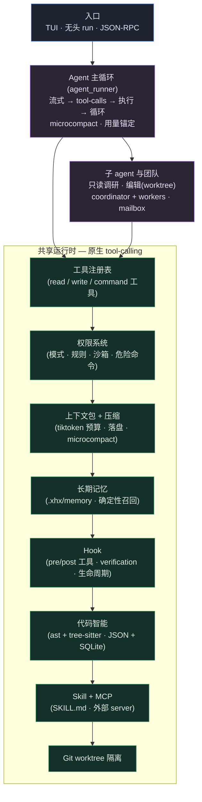

# xhx-agent

<div align="center">

[](https://github.com/kongshuilinhua/XHX-Agent)
[](https://www.python.org/)
[](LICENSE)
[](https://github.com/kongshuilinhua/XHX-Agent/actions/workflows/ci.yml)
[](https://github.com/kongshuilinhua/XHX-Agent/actions/workflows/ci.yml)

[English](README.md) · **简体中文**

</div>

> 一个直接在你的仓库里干活的**本地编码 agent**——一条原生 **tool-calling** 主循环，跑在分层运行时之上：权限门控、MCP、token 预算上下文、长期记忆、Skill、Hook、只读/可写子 agent、隔离 git worktree、多 agent 团队。**针对真实模型（DeepSeek）做了端到端验证**，不只是离线 mock。

`xhx-agent` 跑一个自主的 读 → 改 → 验 循环：每轮模型输出逐 token 流式；每条 shell 命令与文件写入都经权限系统门控；长历史通过压缩保持在 `tiktoken` 预算内；持久事实跨会话存在 `.xhx/memory/`。提供交互式 **Textual TUI**、无头 `xhx run`、以及 JSON-RPC 接口——全部由同一个 agent 核心驱动。

---

## 亮点

- **一条原生 tool-calling 主循环。** 单 agent（`agents/agent_runner.py`）在工具集（`ReadFile`、`EditFile`、`WriteFile`、`ApplyPatch`、`Grep`、`Glob`、`Bash`、`RepoQuery`、`WebFetch`、`WebSearch`、`ToolSearch`、`Agent`…）上迭代 `读 → 搜 → 改 → 验` 直到报告完成——输出逐 token 流式，SSE 上分片的 `tool_calls` 会被重新拼装。
- **真正的权限系统。** 工具分 `read` / `write` / `command` 三类，按模式（`default` / `acceptEdits` / `plan` / `bypassPermissions`）+ 三层 `allow` / `ask` / `deny` 规则引擎（user → project → local，行为优先级 `deny > ask > allow`，Bash 按命令前缀/子命令匹配）+ 危险命令检测 + 敏感路径豁免（`.env` / `.git` / shell 配置即使 bypass 也确认）+ 路径沙箱门控。**Plan 模式两段式**：agent 先只读调研、给出计划，你批准后才执行。
- **始终在预算内的上下文。** 每轮编译一个 `tiktoken` 预算的上下文包；超大工具结果落盘并留预览；长历史被压缩（**microcompact**）成一句摘要，**绝不把 tool_result 与其调用拆散**；跨会话恢复从 `compact_boundary` 记录重建状态。
- **跨会话长期记忆。** `.xhx/memory/` 存持久事实（`user` / `feedback` / `project` / `reference`），**确定性召回**（关键词/token 重叠，不额外调 LLM）在预算内注入 system prompt。已端到端验证：一条**只**存在于记忆里的事实能被召回并影响真实模型的回答。
- **子 agent 与多 agent 团队。** 经 `Agent` 工具派发只读**调研**子 agent 或可写**编辑**子 agent（在自己的 worktree 改、带冲突检测合并回来）；或拉起一个 **Agent Team**（coordinator + workers、mailbox 通信、共享任务板）做并行协作。
- **MCP、Web、Skill。** 从 `.xhx/mcp.json` 连外部 **MCP** server（stdio / Streamable HTTP / SSE）；抓取与搜索网页（带 SSRF 护栏的 `WebFetch` + Tavily `WebSearch`）；加载 **Skill**（`SKILL.md`，三层 builtin/user/project），命中触发词时注入 SOP / 斜杠命令。
- **多模型路由 + 优雅 fallback。** 按角色路由到不同 profile，主模型出错/限流时沿 profile 链降级；与流式正交。

---

## 架构



agent 经原生 tool-calling 驱动模型；权限系统门控每次调用；上下文层把 prompt 保持在预算内；记忆、Hook、代码智能、Skill/MCP、worktree 隔离都挂在同一套共享底座上。子 agent 与团队复用完全相同的工具/安全栈，只是工具集被过滤。

---

## 快速开始

`xhx-agent` 自带 **`mock`** profile，因此整条流水线可**离线、无需 API key**跑通——适合上手试用、CI 和可复现演示。

```bash
git clone https://github.com/kongshuilinhua/XHX-Agent.git
cd XHX-Agent
uv sync
```

在目标代码库里初始化工作区并构建代码智能索引：

```bash
uv run xhx init          # 创建 .xhx/、XHX.md 和代码索引
uv run xhx repo-index    # 打印索引诊断
```

**配一次模型，任何目录可用。** 模型配置按 `项目 .xhx/ → 用户级 ~/.xhx/ → 内置占位` 解析：

```bash
uv run xhx init --global   # 写 ~/.xhx/{config.json,profiles.json}
# 编辑 ~/.xhx/profiles.json 的 default profile（base_url / model / api_key_env），
# 导出该 API key——之后 xhx 在任何目录都能用。项目级 .xhx/profiles.json
# 仍会覆盖全局（例如给 CI 钉死 mock）。
```

打开交互式 agent（主要入口）：

```bash
uv run xhx tui     # 全屏 Textual TUI
uv run xhx chat    # 同一个 TUI（别名）
```

TUI 里模型回复**逐 token 流式**；工具调用连同结果内联渲染；状态栏显示 模式 · 上下文占用 · 工具数 · 模型。输入 `/` 看命令菜单。**Plan 模式两段式**——`/plan` 切到只读调研，agent 给出计划，你批准后才执行任何改动；`shift+tab` 循环切换权限模式。

无头跑任务（脚本 / CI 用）：

```bash
uv run xhx run "讲讲 agent 架构" --profile mock
uv run xhx run "修复 src/calc.py 里挂掉的测试"          # 经你的 default profile 用真实模型
uv run xhx run "继续" --continue                        # 从最近一次会话恢复
```

---

## 功能

运行时被组织成若干聚焦、可独立测试的层：

| 层 | 做什么 |
|:--|:--|
| **工具系统** | 一个 `ToolRegistry` 管理 `Tool` 实例（read/write/command 三类）；deferred 工具经 `ToolSearch` 发现；并发安全工具并行执行。 |
| **Agent 主循环** | 流式原生 tool-calling 循环，带用量锚定、最大轮次守卫、未知工具终止。 |
| **System Prompt** | 由指令（`XHX.md`）、环境上下文、skill 目录、agent 目录、注入的记忆组合而成。 |
| **权限** | 模式 + 三层规则引擎 + 路径沙箱 + 危险命令检测；两段式 plan 模式；TUI 内联审批弹窗。 |
| **MCP** | 从 `.xhx/mcp.json` 连外部 MCP server（stdio / HTTP / SSE）；工具以 `mcp_<server>_<tool>` 注册到同一门控；失败的 server 被跳过。 |
| **上下文管理** | `tiktoken` 预算、超大结果落盘留预览、保有效性的长历史 microcompact。 |
| **记忆** | 长期事实 + 确定性召回 + 新鲜度校验；按会话的 JSONL 持久化与恢复。 |
| **斜杠命令** | 驱动 TUI 的命令注册表（见 [命令](#命令)）。 |
| **Skill** | `SKILL.md`（三层）+ 触发词匹配 → SOP 注入 / 斜杠命令。 |
| **Hook** | 事件引擎（`pre/post_tool_use`、`pre_send`、`turn_*`、`session_*`），动作类型 `command` / `prompt` / `http` / `verification`。 |
| **子 agent** | `Agent` 工具派发只读调研或可写编辑子 agent（工具集被过滤）；编辑子 agent 在隔离 worktree 里干活。 |
| **Worktree** | 完整的 git worktree 生命周期（创建 / 进入 / 退出 / 自动清理）用于隔离改动。 |
| **Agent Teams** | coordinator + workers、文件型 mailbox 通信、共享任务板、按队友的进度。 |

---

## 命令

### CLI

```bash
uv run xhx run "<任务>" [选项]
```

| 选项 | 说明 |
|:--|:--|
| `--profile <名字>` | 模型 profile，按 `项目 .xhx/ → ~/.xhx/ → 内置` 解析（`mock` 离线跑）。 |
| `--verify` | agent 停止后跑变更相关的定向测试。 |
| `-y`, `--yes` | 预批准 confirm 级命令（非交互）。 |
| `--json` | 以结构化 JSON 输出结果。 |
| `--continue` | 从最近一次会话恢复，注入其摘要作为上下文。 |
| `--resume <run-id>` | 从指定历史会话恢复（`xhx sessions` 可列出）。 |

其他命令：`init`（`--global` 写用户级 `~/.xhx/`）、`repo-index`、`sessions`、`tui` / `chat`、`rpc`（stdio 上的 JSON-RPC 2.0）、`replay <run-id>`、`benchmark`、`memory`、`compact`、`config list` / `config set-profile`。

### TUI 斜杠命令

`/help` · `/status` · `/model` · `/plan` · `/permission` · `/compact` · `/memory` · `/session` · `/skill` · `/mcp` · `/review` · `/rewind` · `/tools` · `/worktree` · `/tasks` · `/trace` · `/verbose` · `/cancel` · `/allow` · `/deny` · `/new` · `/clear` · `/exit`

输入 `/` 看完整菜单；`/help <名字>` 看单条命令用法。`/session` 弹出可上下键选择的历史会话列表用于恢复。

---

## Skill

一个 **skill** 就是一份可复用的 SOP——一个 `SKILL.md`（YAML frontmatter + Markdown 提示词正文），agent 按需加载。skill 三层解析，**项目 > 用户 > 内置**（后者被前者覆盖）：

| 位置 | 范围 |
|:--|:--|
| `src/xhx_agent/skills/builtins/` | 随 xhx-agent 内置（`commit`、`review`） |
| `~/.xhx/skills/` | 用户级——所有项目可用 |
| `<项目>/.xhx/skills/` | 项目级——最高优先级 |

**安装一个 skill**：把单文件 `<名字>.md` **或** `<名字>/SKILL.md` 目录丢进上述任一目录，然后在 TUI 里 `/skill reload`——无需重启。frontmatter 只需 `name`（小写字母/数字/连字符）和 `description`；可选：`mode`（`inline` | `fork`）、`context`、`model`、`allowedTools`、`triggers`。Markdown 正文即注入的提示词（`$ARGUMENTS` 用命令参数替换）。每个加载到的 skill 会注册成一个 `/<名字>` 斜杠命令。

```bash
mkdir -p ~/.xhx/skills
cp -r path/to/some-skill ~/.xhx/skills/   # 含 SKILL.md 的目录
# 然后在 TUI 里：/skill reload → /skill list → /some-skill
```

在 TUI 里管理：`/skill list`（带来源标记）、`/skill info <名字>`、`/skill reload`。`SKILL.md` 在共享该格式的 agent 间可移植——Claude Code / `obra/superpowers` 的 skill 可直接放入。只安装可信来源的 skill：目录式 skill 可能携带 `tool.json` + `references/*.py`，其代码会被执行。

---

## 实现状态

如实陈述，绝不把能力与路线图混为一谈。

**已完整实现**
- 原生 tool-calling agent 主循环：流式、并发安全工具并行、用量锚定、长历史 microcompact。
- 权限系统：`default` / `acceptEdits` / `plan` / `bypassPermissions` 模式、三层 `allow` / `ask` / `deny` 规则引擎（user → project → local，`deny > ask > allow`，Bash 前缀/子命令匹配）、路径沙箱、危险命令检测、敏感路径豁免、两段式 plan 模式、TUI 内联审批弹窗。
- 上下文包：`tiktoken` 预算、超大结果落盘 + 预览、保有效性压缩；跨会话恢复经 `compact_boundary`。
- 长期记忆：4 类型事实、预算内确定性召回、新鲜度校验、按会话 JSONL 持久化 + 恢复——已针对真实模型端到端验证。
- 工具：`ReadFile` / `WriteFile` / `EditFile`（读后才能改门控）/ `ApplyPatch`（信封 + unified diff）/ `Grep` / `Glob` / `Bash`（带后台 dev-server 探测）/ `RepoQuery` / `WebFetch`（SSRF 护栏）/ `WebSearch`（Tavily）/ `ToolSearch` / `Agent`。
- MCP 客户端（stdio / Streamable HTTP / SSE）在安全门控下注册；Web 工具；Skill（`SKILL.md`，三层）+ 触发词匹配。
- Hook：生命周期引擎，动作类型 `command` / `prompt` / `http` / `verification`。
- 子 agent（只读调研 + 可写编辑-在-worktree）与 Agent Teams（coordinator + workers、mailbox、共享任务）。
- git worktree 生命周期；代码智能（符号 / import / 引用 / 调用索引，`ast` + tree-sitter，JSON + SQLite）；多模型路由 + fallback。
- 接口：Textual TUI、无头 `xhx run`、JSON-RPC 2.0 stdio；离线 `mock` profile。
- CI：ruff（check + format）、mypy（干净）、pytest，覆盖率下限 **75%**。

**简化 / 部分实现（有意为之）**
- `xhx run` 上更早的 `--mode loop/plan/graph`、`--auto-repair`、`--dry-run` 三个旗标**接受但已是 no-op**——被统一 agent 主循环取代。多 agent 工作经交互运行时的 `Agent` 工具 / Teams 触达，而非 `--mode`。
- Hook 的 `agent` 动作类型（hook 触发子 agent）**已在配置加载阶段停用**——它从未实现；另外三种动作类型正常可用。
- 编辑子 agent 串行执行，各自在自己的 worktree、合并时带冲突检测；真·**并发**子 agent 执行属后续优化。
- 引用索引是文本级 symbol-name 匹配、非语义解析；JS/TS 的 import/call 提取用正则（只有 JS/TS *符号* 用 tree-sitter，Python 用完整 `ast`）。

详见 [`docs/01-architecture.md`](docs/01-architecture.md)。

---

## 项目结构

```text
src/xhx_agent/
  agents/          agent 主循环（agent_runner）· AgentDef 解析+三层加载 · 子 agent · 任务管理 · trace
  tools/           Tool 式注册表 + 内置工具（read/edit/write/bash/grep/glob/apply_patch/repo_query/web/tool-search）
  commands/        slash 命令注册表 + handlers
  context/         上下文包编译器 + tiktoken 预算 + 历史压缩（microcompact）
  memory/          长期事实（确定性召回）+ 会话持久化/恢复
  repo_intel/      符号 / import / 引用 / 调用索引（ast + tree-sitter，JSON + SQLite）
  safety/          风险分级 · 策略 · 权限（rules/sandbox/modes）· worktree 检查点
  hooks/           事件钩子引擎（command/prompt/http/verification 动作）
  skills/          SkillLoader（SKILL.md，三层）+ MCP 客户端管理
  teams/           Agent Teams：coordinator + worker · mailbox · 共享任务库
  worktree/        git worktree 生命周期（创建/进入/退出/清理）
  verification/    定向测试路由（驱动 verification hook）
  filehistory/     按会话的文件编辑历史（rewind 支持）
  evals/           benchmark 台架 + replay + RunMetrics
  evidence/        trace 存储 + 报告生成
  models/          mock + OpenAI 兼容（流式）+ 多模型路由 & fallback
  runtime/         无头驱动 · 会话 · 配置（含 routing）· context-window 解析
  cli/ · tui/      CLI、prompt-toolkit 输入、全屏 Textual TUI、JSON-RPC
```

---

## 开发

```bash
uv run pytest          # 测试套件（521 passed，~75% 覆盖率）
uv run ruff check .    # lint
uv run ruff format .   # 格式化
uv run mypy src        # 类型检查
```

---

<div align="center">
由 <a href="https://github.com/kongshuilinhua/XHX-Agent">kongshuilinhua</a> 构建 · MIT License
</div>
