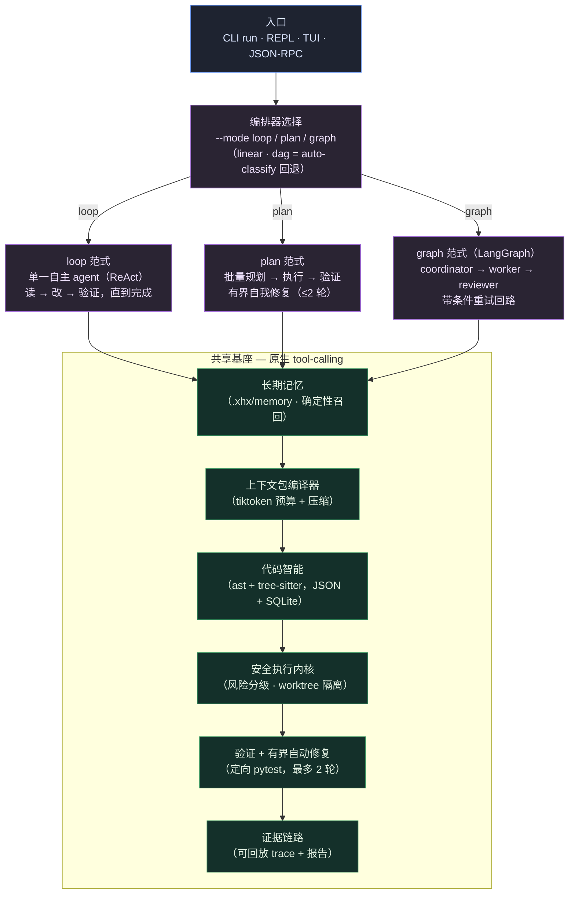

# xhx-agent

<div align="center">

[](https://github.com/kongshuilinhua/XHX-Agent)
[](https://www.python.org/)
[](LICENSE)
[](https://github.com/kongshuilinhua/XHX-Agent/actions/workflows/ci.yml)
[](https://github.com/kongshuilinhua/XHX-Agent/actions/workflows/ci.yml)

[English](README.md) · **简体中文**

</div>

> 一个**上下文预算化的本地编码 agent 运行时**，带**可插拔的三范式编排器**：同一个任务，既可以作为单一自主 **`loop`**（ReAct，类 Claude Code 风格）驱动，也可以作为批量规划的 **`plan`**（Plan-Execute）驱动，还可以作为多 agent **`graph`**（基于 LangGraph）驱动——三者都说**同一套原生 tool-calling 协议**，共用同一套安全 / 上下文 / 代码智能基座。

`xhx-agent` 直接运行在本地仓库内部。它在每一次模型调用前编译一份按 token 预算裁剪的上下文包（context pack），通过安全执行内核对 shell 命令进行分级与拦截，在隔离的 git worktree 中改代码，运行定向测试，并记录可回放的证据链路。同一个任务可以由三种可互换的控制流范式驱动，运行时即可选择——于是 loop、plan、graph 之间的设计取舍变得具体、可对比，并且**用真实数字做了 benchmark**。

---

## 这个项目有意思在哪

- **一套协议，三种范式。** 一套 `Orchestrator` 抽象，三个真实实现，全部通过**原生 tool-calling** 驱动模型（不再有自定义的「model plan」DSL）：自主 **`loop`**（读 → 改 → 验证，反复迭代直到完成）、**`plan`**（批量规划 → 执行 → 验证，带有界自我修复）、以及基于 LangGraph `StateGraph` 的 **`graph`**（coordinator → worker → reviewer，带条件重试回路）。三者共用完全相同的工具、安全、上下文、代码智能层——只有顶层控制流不同。三者都**针对真实模型（DeepSeek）做了端到端验证**，不只是离线 mock。
- **量化，而非空谈。** 内置的 [benchmark 台架](#benchmark量化三范式) 把一批夹具任务分别用三种范式跑一遍，输出对比报告（轮数 / token / 墙钟 / 成功率 / 改动文件）为 Markdown + JSON。token 计量把多 agent 开销变成一个数字：在真实模型（DeepSeek）下，`graph` 完成同样的工作，花费约为单 agent `loop`/`plan` 的 **4 倍 token**——而且并不自动更可靠。
- **跨会话记忆——上下文管理的第四轴。** 在「逐轮预算化、loop 内历史压缩、子 agent 委派」之外，`xhx-agent` 维护一个 `.xhx/memory/` 的耐久事实库（`user` / `feedback` / `project` / `reference`）。召回是**确定性**的（对每条事实的 description 做关键词/token 重叠——无额外 LLM 调用），并在 token 预算内注入 system prompt；一道新鲜度校验会跳过点名了已不存在文件的记忆。写入有两条路：显式（`/remember`）或**建议-确认**（agent 跑完后提议，你一键确认）。已端到端验证：一条**只存在于记忆**里的事实被真实模型召回并使用。
- **多模型路由 + 优雅降级。** 一次 run 可以按角色把不同步骤路由到不同 profile——便宜模型做探索/摘要、强模型做改代码——并在主模型出错/限流时**沿 profile 链降级**（对标 Claude Code 的 `fallbackModel`）。路由与流式正交：fallback 包装器会把流式回调转发给真正服务的那个客户端。
- **流式，且不破坏预算。** tool-calling 主循环把模型输出**逐 token 流式**喂到一条细状态行（并把 SSE 上分片到达的 `tool_calls` 重新拼装），同时用 **microcompact** 把长历史压在预算内——把对话中间的旧段落压成一条摘要，*且绝不让某个工具结果与它的调用脱节*。
- **按 token 预算的上下文包。** 每一次模型调用都喂入一份确定性预算化的上下文包（项目地图 / 任务 / 源码 / 证据 / 错误），用 `tiktoken`（`cl100k_base`）精确计数，溢出时按优先级裁剪。长自主循环中的历史被压缩而非丢弃。
- **安全执行内核。** shell 命令经 `shlex` 分词后被分为 `safe` / `confirm` / `deny` 三档，配合可执行文件黑名单、shell 元字符拦截、内联解释器检测作为纵深防御。编辑在隔离的 git worktree 中进行，只有成功时才同步回原工作区。
- **代码智能。** 由 Python `ast` 与 tree-sitter（用于 JS/TS）构建的符号 / import / 引用 / 调用索引，以 JSON 主索引 + SQLite 镜像落盘，并在文件变更时增量刷新。
- **诚实的实现状态。** [实现状态](#实现状态)小节明确区分「已完整实现」与「简化 / 部分实现」；[工程手记](#工程手记构建过程教会我的事)则记录了哪些东西在真实模型下崩了、以及光靠一段提示词*解决不了*什么。

---

## 架构



三种范式发出的是**同一批工具调用**（`search`、`read_file`、`apply_patch`、`repo_query`、`verify`、`terminal`、`dispatch`……），走的是**同一个内核**——区别纯粹在于*谁来决定下一步调什么*：一个 agent（`loop`）、一个先规划后执行的控制器（`plan`）、还是一支 coordinator/worker/reviewer 团队（`graph`）。与范式正交地，每次 run 都会**按角色路由模型 profile 并带 fallback 链**、**逐 token 流式**输出、并用 **microcompact** 把长历史压在预算内。

---

## 快速开始

`xhx-agent` 内置一个 **`mock`** profile，因此整条流水线可以**离线、无需 API key** 运行——非常适合试用、CI 和可复现的演示。

```bash
git clone https://github.com/kongshuilinhua/XHX-Agent.git
cd XHX-Agent
uv sync
```

在你的目标代码库中初始化工作区并构建代码智能索引：

```bash
uv run xhx init          # 创建 .xhx/、XHX.md 和仓库索引
uv run xhx repo-index    # 打印索引诊断
```

来自本仓库的真实输出：

```text
repo index: current
schema: 1
files: 165
symbols: 860
import edges: 388
call edges: 2000
references: 2000
```

无头方式运行一个任务。`--dry-run` 预览计划与 token 预算，不改文件：

```bash
uv run xhx run "explain the orchestrator architecture" --profile mock --dry-run
```

```text
status: success
summary: Read-only mock plan.
steps: 1
context: 5068/6000 estimated tokens
trace: .xhx/traces/dry-run-...jsonl
```

用 `--mode` 显式指定编排器范式：

```bash
uv run xhx run "refactor the math helpers" --profile mock --mode loop    # 自主 ReAct 循环
uv run xhx run "refactor the math helpers" --profile mock --mode plan    # 规划 → 执行 → 验证
uv run xhx run "refactor the math helpers" --profile mock --mode graph   # LangGraph 多 agent
```

打开交互式 REPL 或全屏看板：

```bash
uv run xhx chat              # 带 slash 命令的 prompt-toolkit REPL
uv run xhx tui --fullscreen  # Textual 看板
```

在 REPL 里，模型的回答会**逐 token 流式**滚进一条细状态行（`state · mode · turn · tokens · streaming`）。用 `/remember <事实>` 教它记住耐久事实、`/memory` 列出、`/automem on|off` 开关跑后的**建议-确认**自动抽取。要把角色路由到更便宜/更强的模型并加 fallback 链，编辑 `.xhx/config.json` 里的 `routing` 块（`roles: {explore: cheap, …}`、`fallback: [strong, …]`）。

---

## 三种执行范式

三者跑在完全相同的工具 / 安全 / 上下文 / 代码智能基座、以及同一套原生 tool-calling 协议之上——只有控制流不同。

| | `loop`（默认） | `plan` | `graph` |
|:--|:--|:--|:--|
| **风格** | 单一自主 agent（ReAct） | Plan-Execute 控制器 | 多 agent 工作流（LangGraph `StateGraph`） |
| **控制流** | 一个模型持续迭代 读 → 改 → 验证，最多 `max_loop_turns` 轮，直到它报告完成 | 先把整个任务批量规划，执行各步，验证，失败时跑有界自我修复 | 显式角色：coordinator 拆任务 → 可写的 worker 执行每个子任务 → reviewer 判 PASS/FAIL，带条件重执行回路 |
| **任务分解** | 隐式、逐轮 | 批量、前置 | coordinator 驱动，拆成子任务 |
| **适合** | 开放式编辑、探索性工作 | 需要明确「计划 + 验证门」的任务 | 需要「计划 / 执行 / 复核」跨角色分离的任务 |
| **真实模型开销** | 最低（1 个 agent） | 低（1 个 agent + 验证） | 最高（约 4× token、~3× 耗时——多 agent 通信） |
| **选择方式** | `--mode loop` / `/mode loop` | `--mode plan` / `/mode plan` | `--mode graph` / `/mode graph` |

省略 `--mode` 时，意图分类器会把任务经一条轻量的 `linear` / `dag` 回退路径路由（`direct` / `research-only` / `linear-edit` / `dag-execute`）。这两者是 **auto-classify 路径的支撑机制**，并非头条范式——对任何非平凡任务，请显式选 `loop`、`plan` 或 `graph`。

---

## Benchmark：量化三范式

核心论点——*一套基座、三种可互换范式*——只有用数字才有说服力。`xhx benchmark` 把一批夹具任务分别用各范式跑一遍，写出对比报告（`.xhx/benchmark/report.md` + `report.json`）：

```bash
uv run xhx benchmark --modes loop,plan,graph --profile default  # 真实模型（DeepSeek）
uv run xhx benchmark --modes loop,plan,graph                    # 离线、确定性（mock）
```

**真实模型**（DeepSeek `deepseek-chat`）——三个只读研究夹具，按范式取均值：

| 范式 | 成功率 | 平均轮数 | 平均 tokens | 平均墙钟(s) |
|:--|:--:|:--:|:--:|:--:|
| `loop` | 3/3 | 4.7（工具轮） | ~14.3K | 14.1 |
| `plan` | 3/3 | 4.0（工具轮） | ~15.0K | 13.0 |
| `graph` | 2/3 | 1.7（评审轮） | **~58.9K** | 44.6 |

两点最扎眼：

- **多 agent 的 `graph` 花费 ~4× token、~3× 墙钟**，远高于单 agent 的 `loop`/`plan`——coordinator、worker、reviewer 各自携带自己的完整上下文。（它更低的「轮数」是*另一种单位*——评审轮，而非工具轮。）
- **这里「多 agent」并没有换来更好的结果：** `graph` 只在 3 个夹具里成功了 2 个（一次被 reviewer 判 FAIL），而 `loop` 与 `plan` 三个全过。角色分离买来的是显式的「计划/复核」结构——它不是免费的，也并不自动更可靠。

离线 `mock` profile 能确定性地复现*同样的形态*（`graph` 约为 `loop`/`plan` 的 3 倍 token），供 CI 与无密钥演示之用，只是它不触发 `graph` 所依赖的 LLM 协调——所以那里的成功率只有在真实模型下才有意义。用上面的命令自己复现任一张表（`--profile default` 需要环境里有 `DEEPSEEK_API_KEY`）。

<details>
<summary>离线 <code>mock</code> 表（确定性、可复现）</summary>

| 范式 | 任务数 | 平均轮数 | 平均 tokens | 平均墙钟(s) |
|:--|:--:|:--:|:--:|:--:|
| `loop` | 3 | 1.0 | ~978 | 0.40 |
| `plan` | 3 | 1.0 | ~986 | 0.38 |
| `graph` | 3 | 2.0 | ~2919 | 0.77 |

</details>

---

## 工程手记：构建过程教会我的事

三个比「测试全绿」更有价值的发现——每一个都是*真实*模型与舒适的离线 mock 分道扬镳的地方。

**1 · `apply_patch` 撞上真实模型。** patch 工具最初是围绕自定义的 `*** Begin Patch … *** End Patch` 信封构建的，离线 mock 也老老实实产出它。换成真实 DeepSeek 后，*每一次*编辑都失败：`Patch must start with *** Begin Patch`。真实模型产出的是 **unified diff**——常常还裹在 ```` ```diff ```` 围栏里——而不是那个自定义信封。修复办法是让解析器**按格式分派**：信封、unified diff（`---` / `+++` / `@@`，其中 `/dev/null` 表示新建文件）、以及一道剥围栏的预处理。**教训：** mock 对齐不等于真实对齐。真实模型的输出分布*本身*就是你必须解析的规格。

**2 · 提示词不是银弹。** 我加了一个 `dispatch` 工具，让 agent 能把聚焦的、跨多文件的调查交给一个隔离的只读子 agent——保持父上下文干净。这个能力已接好、有门控、也正确。但即便给了明确的提示词引导，真实模型也压倒性地更愿意自己直接读文件，很少去用 `dispatch`。与其粉饰，我如实记下：**改变模型行为往往需要比系统提示词里一段话更强的机制**——而知道这个差别，本身就是这份工作的一部分。

**3 · 给「协调」标个价。** 一个小小的 token 计量器包住每一次模型调用，把出站上下文的 `tiktoken` 估算累加进运行指标。正是它把「graph 开销更大」变成了真实模型表里的「graph 花约 4× token」。构建成本很低，却把一个架构直觉变成了 reviewer 可以核对的东西。

**4 · 一个「注入型」功能，要等到一条只存在于记忆里的事实改变了输出，才算是真的。** 跨会话召回很容易*接上*、也很容易自欺。所以测试不是「召回函数有没有返回行」，而是：写一条**只存在于** `.xhx/memory/` 里的事实（项目吉祥物是一只叫 Pacha 的蓝色蝾螈），问真实模型一个本来答不出的问题，确认这条被召回的事实**既进了 system prompt、又左右了答案**。**教训：** 任何会悄悄注入上下文的功能，都要用一条模型本来不可能知道的事实做端到端验证——而不是给检索器写个单测了事。

---

## 命令

### CLI

```bash
uv run xhx run "<task>" [options]
```

| 选项 | 说明 |
|:--|:--|
| `--profile <name>` | 来自 `.xhx/profiles.json` 的 LLM profile（`mock` 离线运行）。 |
| `--mode <loop\|plan\|graph\|linear\|dag>` | 选择编排器范式（默认：按意图自动分类）。 |
| `--auto-repair` | 定向验证失败时，启用最多 2 轮自我修复。 |
| `--dry-run` | 预览计划、token 预算与风险后退出。 |
| `-y`, `--yes` | 预先批准 `confirm` 档命令（非交互）。 |
| `--json` | 以结构化 JSON 输出运行结果。 |
| `--continue` | 从最近一次会话恢复，并把其摘要作为上下文注入。 |
| `--resume <run-id>` | 从指定的历史会话恢复（`xhx sessions` 可列出）。 |

其他命令：`init`、`repo-index`、`sessions`、`chat`、`tui`、`rpc`（stdio 上的 JSON-RPC 2.0）、`replay <run-id>`、`benchmark`、`memory`。

### REPL slash 命令

`/help` · `/model` · `/mode` · `/status` · `/plan` · `/evidence` · `/context` · `/verify` · `/repair` · `/diff` · `/skills` · `/remember` · `/memory` · `/automem` · `/dashboard` · `/live` · `/cancel` · `/clear` · `/exit`

---

## 实现状态

如实陈述，绝不把能力与路线图混为一谈。

**已完整实现**
- 一套原生 tool-calling 协议上的三范式编排器：`loop`（自主 ReAct）、`plan`（Plan-Execute，带有界自我修复）、`graph`（LangGraph coordinator → worker → reviewer）——全部接入每个入口（CLI `--mode`、REPL/TUI `/mode`），且全部针对真实模型做了端到端验证。
- 经 `dispatch` 工具的隔离只读子 agent（聚焦探索，有自己的消息历史与受限工具集）。
- 三范式 benchmark 台架（`xhx benchmark --modes …`），输出 Markdown + JSON 对比报告，带逐调用 token 计量。
- 长期记忆：`.xhx/memory/` 的 4 类型事实，确定性召回在预算内注入 system prompt，含对当前文件的新鲜度校验，显式 `/remember` 写入，以及跑后的**建议-确认**自动抽取（`/automem`）——已针对真实模型端到端验证。
- 多模型路由：按角色的 `role → profile` 映射 + 一条有序 **fallback 链**，主模型出错/限流时优雅降级；与流式正交。
- tool-calling 输出**流式**到一条细状态行（分片的 `tool_calls` 在 SSE 上被重新拼装），外加保有效性的长历史 **microcompact**。
- 只读 `repo_query` 工具，经同一套风险门控内核把符号 / 引用索引暴露给模型。
- 上下文包编译器：`tiktoken` 预算、优先级裁剪、历史压缩（启发式；自主模式下用 LLM 摘要，出错回退启发式）。
- 安全执行内核：风险分级、黑名单 + 元字符 + 内联解释器拦截、git worktree 隔离、就地 Restore Plan 回退。
- 代码智能：符号 / import / 引用 / 调用索引——Python 走 `ast`，JS/TS 符号走 tree-sitter——以 JSON 主索引 + SQLite 镜像落盘，文件变更时增量刷新。
- 验证路由 + 有界（≤2 轮）自动修复；可回放证据 trace；会话恢复（`--continue` / `--resume` / `sessions`）。
- REPL（prompt-toolkit）与全屏 TUI（Textual）；JSON-RPC 2.0 stdio 接口；离线 `mock` profile；benchmark + replay。

**简化 / 部分实现（有意为之）**
- `linear` / `dag` 作为轻量的 auto-classify 回退保留（仅在省略 `--mode` 时使用）；头条的分解工作发生在 `plan` 与 `graph`，二者经 tool-calling 由 LLM 驱动。
- `graph` 范式是刻意精简的 coordinator → worker → reviewer 工作流，为与 `loop`/`plan` 形成干净对照而保持最小。
- `dispatch` 覆盖只读的 `explore` 子 agent；可写与并行子 agent 属于后续工作。
- 引用索引是文本级 symbol name 匹配，非语义解析。
- JS/TS 的 import 与 call 提取用正则（只有 JS/TS *符号* 用 tree-sitter）；Python 用完整 `ast`。

详见 [`docs/implementation/20-implementation-baseline.md`](docs/implementation/20-implementation-baseline.md) 和 [`docs/01-architecture.md`](docs/01-architecture.md)。

---

## 项目结构

```text
src/xhx_agent/
  orchestrators/   loop · plan · graph（主）+ linear · dag（回退）· 子 agent · microcompact
  memory/          长期事实：存储 + 确定性召回 + 建议-确认抽取
  context/         上下文包编译器 + token 预算 + 压缩
  repo_intel/      符号 / import / 引用 / 调用索引（ast + tree-sitter，JSON + SQLite）
  safety/          风险分级 · 策略 · worktree · 检查点 · 修复
  planner/         意图分类器 · 执行模式 · reviewer · agents
  verification/    定向测试路由
  evals/           benchmark 台架 + RunMetrics
  evidence/        trace 存储 + 报告生成
  runtime/         应用主循环 · 会话 · 配置（含 routing）
  models/          mock + OpenAI 兼容（流式）+ 多模型路由 & fallback
  cli/ · tui/      REPL、全屏看板、JSON-RPC
```

---

## 开发

```bash
uv run pytest          # 测试套件
uv run ruff check .    # lint
uv run ruff format .   # 格式化
uv run mypy src        # 类型检查
```

---

<div align="center">
由 <a href="https://github.com/kongshuilinhua/XHX-Agent">kongshuilinhua</a> 构建 · MIT License
</div>
