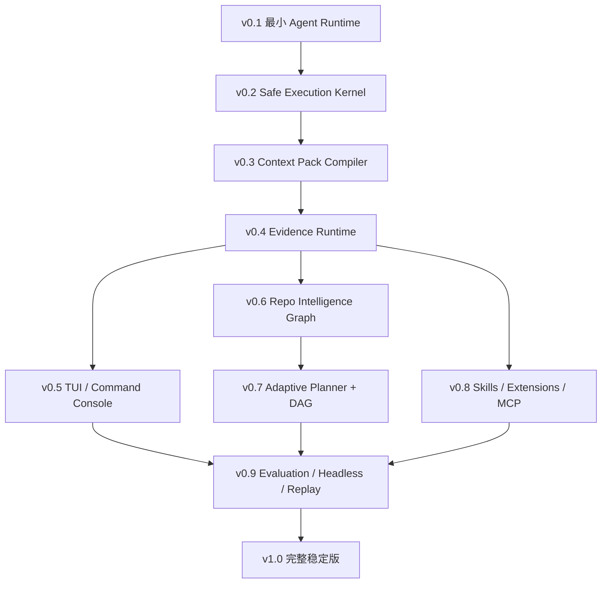

# 实施文档索引

本目录是 xhx-agent 的实施层文档。上层文档说明项目方向，本目录说明如何把项目做出来。

## 阅读顺序

建议按下面顺序阅读：

1. [模块边界](14-module-boundaries.md)：先确认模块职责和禁止依赖。
2. [运行时契约](15-runtime-contracts.md)：理解消息、事件、工具结果和持久化协议。
3. [v0.1 实施规格](16-v0.1-implementation-spec.md)：直接进入第一版编码任务。
4. [全版本任务拆分](17-version-breakdown.md)：查看 v0.1 到 v1.0 的版本落点。
5. [测试 Fixture 与验收](18-testing-fixtures.md)：确认测试仓库、验收命令和矩阵。
6. [TUI / Command Console 规格](19-tui-command-console-spec.md)：查看 v0.5 终端交互设计。
7. [版本实施基线](20-implementation-baseline.md)：固定版本名称、当前状态、进入条件和路线变更规则。

## 文档分层

```text
README.md
  -> docs/12-development-plan.md
    -> docs/implementation/13-implementation-index.md
      -> module contracts / version specs / fixtures / TUI
```

## 版本依赖图



## pi 经验吸收方式

xhx-agent 参考 pi 的模块边界，但不照搬 TypeScript monorepo。

对应关系：

| pi 模块 | xhx-agent 模块 | 吸收点 |
| --- | --- | --- |
| `pi-ai` | `models` | 模型 provider 差异压到 adapter，向上输出统一事件。 |
| `pi-agent-core` | `agent_core` / `graph` | 通用 tool-use loop 不依赖 CLI、TUI、session。 |
| `pi-coding-agent` | `runtime` | 产品层装配配置、session、工具、安全、上下文、证据和扩展。 |
| `pi-tui` | `tui` | 终端渲染和业务事件分离。 |
| extension / skill | `skills` | progressive disclosure，hook 不能提升权限。 |

## 实施原则

- 模块之间通过类型、事件和协议通信，不跨层调用内部实现。
- v0.1 可以先实现最小功能，但目录和契约要按长期结构放置。
- 每个版本都必须可运行、可测试、可验收。
- 文档描述 planned 能力时必须保持“当前版本”和“后续版本”边界。
- 开发时以 [版本实施基线](20-implementation-baseline.md) 为准，不新增未记录的小版本名。
